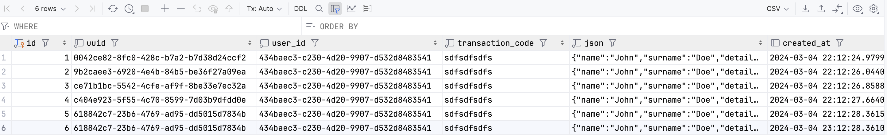

# Microservice Architecture for Order Service

This project showcases a microservices architecture for an Order Service, designed to handle order processing and communication through Kafka.

## Order Service

The Order Service is responsible for managing orders and ensures that updates to the order status are reliably communicated through Kafka. Each order, upon processing, is written to two tables: one for order details and another acting as an "outbox" for event publishing.

### Database Structure

The service utilizes a database with two tables:

1. **orders**: Stores details of each order.
2. **outbox**: An outbox table containing events for order status changes.  


## Kafka Integration

To facilitate communication and ensure event-driven architecture, Kafka is employed along with a Kafka JDBC connector. This enables reliable and asynchronous communication between microservices.
```json
{
  "name": "jdbc-source-connector",
  "config": {
    "connector.class": "io.confluent.connect.jdbc.JdbcSourceConnector",
    "connection.url": "jdbc:postgresql://postgres:5432/postgres",
    "connection.user": "postgres",
    "connection.password": "postgres",
    "topic.prefix": "microshop.order-",
    "mode": "incrementing",
    "incrementing.column.name": "id",
    "table.whitelist": "outbox",
    "poll.interval.ms": "5000",
    "value.converter": "org.apache.kafka.connect.json.JsonConverter",
    "key.converter": "org.apache.kafka.connect.storage.StringConverter",
    "key.converter.schemas.enable": "false",
    "transforms": "createKey",
    "transforms.createKey.type": "org.apache.kafka.connect.transforms.ValueToKey",
    "transforms.createKey.fields": "user_id"
  }
}
```
1. go to build and read more.


### Kafka JDBC Connector

A Kafka JDBC connector is configured to read events from the **outbox** table and publish them to Kafka topics. This ensures that any change in the order status is immediately available for consumption by other microservices.

## Order Background Service

The Order Background Service is a microservice designed to listen to Kafka topics and react to order status changes. It subscribes to the relevant Kafka topics, processing messages and performing any necessary background tasks related to order updates.

## Running the Project

1. **Order Service**: Run the Order Service to process orders and populate the database.

2. **Kafka JDBC Connector**: Set up the Kafka JDBC connector to read from the **outbox** table and publish messages to Kafka. Update the configuration to match your Kafka setup.

3. **Order Background Service**: Deploy and run the Order Background Service to consume messages from Kafka, reacting to order status changes.

## Conclusion

This microservices architecture ensures a loosely-coupled and scalable design for the Order Service, utilizing Kafka for reliable communication and asynchronous processing. The separation of concerns into different microservices allows for flexibility and ease of maintenance.

---
### Links:

Kafka connector API:
https://docs.confluent.io/platform/current/connect/references/restapi.html

Kafka UI:
https://github.com/provectus/kafka-ui

