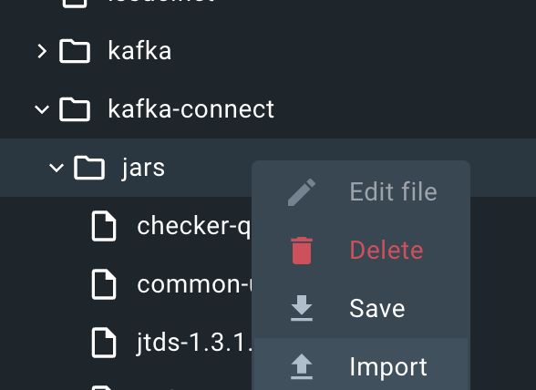

## Download connector to your computer 

1) go to the site:

Link:
https://docs.confluent.io/kafka-connectors/jdbc/current/source-connector/overview.html#install-the-jdbc-sink-connector

2) Run you connector with docker.

3) Add ALL jars to folder: /etc/kafka-connect/jars 

4) restart you connector 

5) curl http://localhost:8083/connector-plugins 

6) run kafka.sh